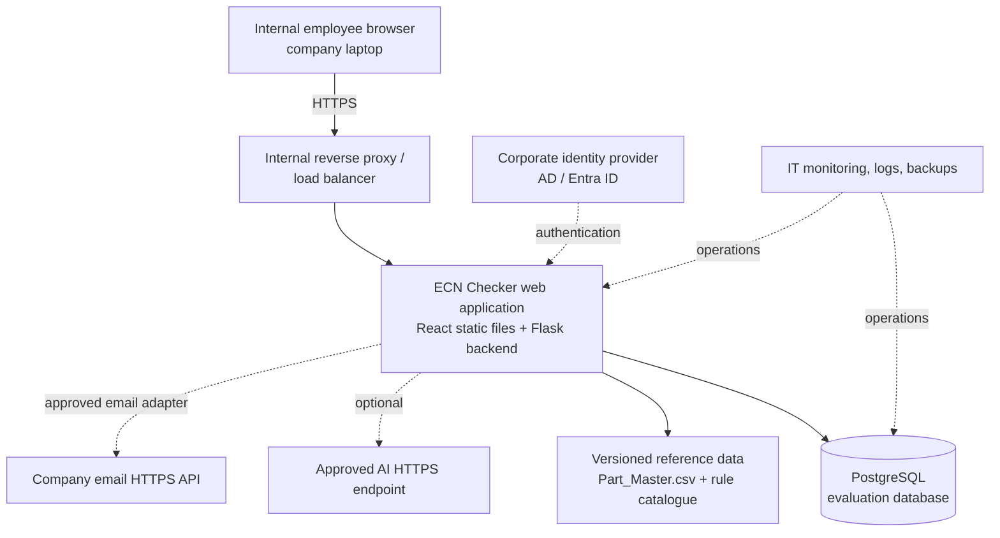

# ECN Checker — Internal Deployment Architecture

## Purpose

This document describes the proposed deployment for an internal ECN Checker evaluation website. Employees use a browser from a company laptop; they do not install the application or connect directly to PostgreSQL.

## Proposed architecture

## Workloads

### Prototype / staging

The current prototype runs locally during development:

- React frontend served by Vite during development
- Python Flask backend on port `5000`
- PostgreSQL evaluation database
- Local reference files under `data/`
- Email delivery disabled or configured as a test-only integration

For an IT-managed prototype environment, deploy it as an internal staging website. It should use a separate staging database and separate secrets from production.

### Production

The production workload should run in an approved internal hosting environment selected by IT. AWS is not assumed at this stage; no AWS account, workload name, or Region has been allocated.

Recommended production arrangement:

- Internal DNS name, for example `ecn-checker.<internal-domain>`
- HTTPS with an internally approved certificate
- Reverse proxy or load balancer in front of the application
- Flask application process managed by the hosting platform
- Built React assets served by the application or approved web server
- PostgreSQL on an approved managed database service
- Access restricted to authorised Fisher & Paykel users through the corporate network or VPN
- Separate production secrets and database credentials

## Runtime responsibilities

### Browser

The browser provides:

- Sign-in screen
- ECN and BOM upload
- Pre-check action
- Rule findings and explanations
- Tester judgement submission
- Reviewer queue and assigned-attempt review
- Administrator evaluation metrics

The browser must never receive PostgreSQL credentials.

### Flask backend

The Flask backend owns the server-side interface and:

- Authenticates users or integrates with corporate identity
- Enforces tester, reviewer, and administrator permissions
- Accepts uploaded ECN/BOM files
- Runs intake, deterministic rules, AI advisory, context checks, and gate decision logic
- Persists evaluation sessions, results, findings, uploaded-file metadata, and judgements
- Retrieves reviewer assignments and evaluation metrics
- Calls the approved email integration

### PostgreSQL

PostgreSQL stores evaluation data, including:

- `app_users`
- `evaluation_sessions`
- `precheck_attempts`
- `evaluation_events`
- `evaluation_files`
- `tester_judgements`
- `review_assignments`
- `reviewer_submissions`
- `notification_attempts`

The application must use a dedicated least-privilege database user. Administrators must not use the PostgreSQL superuser account from the application.

### Reference data

The rule catalogue and `Part_Master.csv` are application reference data. They should be versioned and deployed with the application release, or moved to an approved read-only reference-data location.

## Email integration

The preferred production design is an HTTPS call to an approved Fisher & Paykel email API. The email adapter should support:

- A company-approved sender address
- Internal recipients only (`@fisherpaykel.com`)
- PASS notifications to the next checker
- FAIL notifications to the submitting tester
- Delivery status recorded in `notification_attempts`
- No raw ECN/BOM file attachments by default

Email content should contain only the minimum necessary information, such as the ECN identifier, PASS/FAIL result, rule summary, and an internal application link. Sensitive ECN/BOM content should remain in protected server-side storage.

The current prototype has notification behavior and SMTP-oriented configuration. Production deployment should use the approved HTTPS email adapter once IT provides its endpoint and authentication requirements.

## Security requirements

- HTTPS for every browser-to-application connection
- Corporate authentication preferred over application-managed passwords
- Role-based access for `TESTER`, `REVIEWER`, and `ADMINISTRATOR`
- PostgreSQL accessible only from the application server or approved network
- Secrets stored in the approved secret-management system
- No credentials committed to source control
- Uploaded files treated as confidential engineering data
- File-size and file-type restrictions enabled
- Audit events retained for pre-checks, judgements, assignments, and notifications
- Application and database logs must not contain passwords, tokens, or uploaded file contents
- Backups encrypted and access-controlled

## Network flows

| Source | Destination | Protocol | Purpose |
|---|---|---|---|
| Employee browser | Internal reverse proxy | HTTPS / 443 | Website access |
| Reverse proxy | Flask application | Internal HTTP or HTTPS | Forward browser requests |
| Flask application | PostgreSQL | PostgreSQL/TLS | Evaluation persistence |
| Flask application | Approved AI endpoint | HTTPS / 443 | Optional advisory checks |
| Flask application | Approved email API | HTTPS / 443 | Validation notifications |
| IT monitoring | Application and database | Approved monitoring protocol | Health and operational monitoring |

## Environment separation

Prototype/staging and production should have separate:

- Application deployments
- PostgreSQL databases
- Database users and passwords
- Flask session secrets
- Email credentials or API tokens
- AI credentials
- Uploaded-file storage

Staging data must not be copied into production unless explicitly approved.

## Operational requirements

IT should provide:

1. Internal DNS name
2. HTTPS certificate
3. Hosting location and deployment method
4. Corporate authentication decision
5. PostgreSQL host/database and backup policy
6. Approved email API details
7. Firewall and VPN access rules
8. Application process restart policy
9. Centralised logs and monitoring
10. Staging environment for acceptance testing
11. Production release and rollback procedure
12. Data-retention and deletion policy

## Acceptance test

The deployment is ready for internal evaluation when:

1. An authorised employee opens the internal HTTPS URL from a company laptop.
2. A tester uploads an ECN and BOM and runs a pre-check.
3. The result shows the system decision, rules checked, findings, and explanations.
4. The completed evaluation is saved in PostgreSQL.
5. A reviewer can see an evaluation assigned to them.
6. A reviewer can submit an independent judgement.
7. An administrator can view PASS/FAIL, duration, and agreement metrics.
8. Approved email delivery works without exposing uploaded files as attachments.
9. An unauthorised user cannot access evaluation data.
10. The application and database recover according to the agreed restart and backup procedures.
